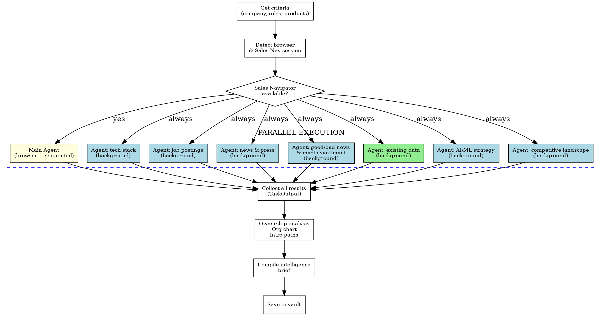

# Sales Research

Sales intelligence research with **LinkedIn Sales Navigator as the primary tool**, supplemented by web research for context.

## Trigger

User says:
- "research [company]" / "research [company] on Sales Navigator"
- "find contacts at [company]"
- "who are the DevOps/cloud/engineering people at [company]"
- "prepare for meeting with [company]"
- "build a contact list for [company]"
- "prospect research for [company]"
- "I need to talk to [company] about [product]"

## Preflight Check (Auto-Fix)

**Run this BEFORE any research.** Check each dependency and fix automatically if missing. Only ask the user when their input is required (e.g., login credentials).

```
For each check below:
  ✅ = already good, skip
  🔧 = missing, fix it automatically
  👤 = needs user action, tell them exactly what to do
```

### 1. Node.js

```bash
node --version
```

- ✅ Returns version → continue
- 🔧 Command not found →
  ```bash
  # Install via Homebrew (install Homebrew first if needed)
  which brew || /bin/bash -c "$(curl -fsSL https://raw.githubusercontent.com/Homebrew/install/HEAD/install.sh)"
  brew install node
  ```
  After install, verify: `node --version`

### 2. Google Chrome

```bash
ls "/Applications/Google Chrome.app"
```

- ✅ App exists → continue
- 👤 Not found → tell the user:
  > Google Chrome is not installed. Please download and install it from https://www.google.com/chrome/ then say "continue".

### 3. Superpowers Chrome Plugin

Verify the superpowers-chrome plugin is available:

```
# Check if superpowers-chrome is available by testing browser mode
mcp__plugin_superpowers-chrome_chrome__use_browser(action: "browser_mode")
```

- ✅ Returns browser status JSON → continue
- 🔧 Tool not available → tell the user:
  > The superpowers-chrome plugin is not installed. Please install it from the Claude Code marketplace, then restart your Claude Code session and repeat your request.
  **Stop here** — the plugin won't load until Claude Code restarts.

### 4. Output directories

```bash
ls HashiCorp/by-customer/ 2>/dev/null
```

- ✅ Directory exists → continue
- 🔧 Missing →
  ```bash
  mkdir -p HashiCorp/by-customer
  ```

Create and use a single company folder for all research artifacts:
- `HashiCorp/by-customer/[Customer Folder]/[Company Folder]/`

Where:
- `[Customer Folder]` is the deterministic filesystem-safe customer/account folder. First collect or infer the underlying customer/account name (not a literal folder token), then derive or resolve the folder from that name using the same cleanup rules as the company folder: replace `/` and `\` with ` - `, replace other path-special characters (`: * ? " < > |`) with `-`, trim trailing periods/spaces, and collapse repeated whitespace.
- Before deriving any new path, check whether prior research already established a matching customer folder by searching normalized customer/account names, known aliases, and legacy research paths. Reuse that canonical customer folder whenever it already exists instead of creating a second customer tree with a different alias. Only ask the user to override the folder name if automatic resolution fails or remains ambiguous after those checks.
- `[Company Folder]` is a deterministic filesystem-safe version of the display company name inside the resolved canonical customer folder. Derive it automatically from `[Company]`; only reuse a different folder name when an existing folder in that canonical customer folder already establishes the path for that company.
- `[Brief Filename]` is the filesystem-safe final brief filename. Use the sanitized company token in the filename, for example `[Company Folder] Sales Intelligence Brief.md`.
- `[Legacy Brief Filename]` refers to any pre-migration brief filename found in the resolved canonical customer folder. Inspect and migrate that existing file into the unified company folder instead of continuing to write to the legacy path. Migration must be one-way: move the legacy brief into the unified company folder when possible; if a manual merge is required, archive, remove, or tombstone the old flat brief immediately after the merge succeeds so later sessions do not re-import it.
- Keep the original display company name (`[Company]`) in the brief title and body.

Store **every** intermediate markdown artifact directly in that company folder.

Examples:
- `HashiCorp/by-customer/Telstra/Singtel Optus/`
- `HashiCorp/by-customer/Commonwealth Bank/Reserve Bank of Australia/`
- `HashiCorp/by-customer/Qantas/Qantas Airways - Jetstar/`

### 5. CLAUDE.md (user context — Claude Code reads this automatically)

```bash
cat CLAUDE.md 2>/dev/null
```

- ✅ Exists and has content → continue (use it for customer cross-referencing)
- ⚠️ Missing or empty → proceed without it, but mention:
  > **Tip:** Create a `CLAUDE.md` file in this folder with your name, role, and customer list. This helps me cross-reference existing accounts and personalise research. You can do this after this session.

### Preflight summary

After all checks pass, announce:

> ✅ All dependencies verified. Starting research.

Then proceed to Research Priority Order below.

## Research Priority Order

**Sales Navigator FIRST, web research SECOND.** The rationale:

1. **Sales Navigator** gives real-time org data — titles, tenure, reporting lines, recent job changes, mutual connections, and activity signals. This is the highest-value source for identifying WHO to talk to.
2. **Web research** (Exa, Google, company websites) provides technology context — what stack they use, recent initiatives, press releases, conference talks. This tells you WHAT to talk about.
3. **Combined** = a complete sales intelligence brief: the right people + the right talking points.

### When to skip Sales Navigator
- User explicitly says "just do web research" or "don't use LinkedIn"
- Sales Navigator is confirmed unavailable after checking (see Browser Detection below)
- Research is purely about technology/architecture with no people-finding component

## Prerequisites & Browser Detection

### Detecting Browser State

**ALWAYS check browser state FIRST before any navigation.**

Use superpowers-chrome to detect the current browser state:

1. **Check browser mode**: `{action: "browser_mode"}` — returns whether Chrome is running, headless/headed mode, and current profile
2. **List open tabs**: `{action: "list_tabs"}` — returns all open tabs with URLs
3. **Check if any tab is on Sales Navigator** — look for URLs containing `linkedin.com/sales/` in the tab list

**Decision tree:**

```
{action: "list_tabs"} succeeds?
├── YES → Tabs returned
│   ├── Sales Navigator tab exists? → Use it (pass tab_index), verify auth
│   └── No Sales Nav tab? → Navigate to Sales Navigator
│       │   {action: "navigate", payload: "https://www.linkedin.com/sales/search/people"}
│       ├── Authenticated? → Read auto-captured .md file, look for search UI → Proceed
│       └── Login page? → Switch to headed mode for user login (see below)
└── NO → superpowers-chrome not available → error with setup instructions
```

**Browser invariant:** Always use `mcp__plugin_superpowers-chrome_chrome__use_browser` for browser work. Do **not** manually launch Chrome, do not switch to another browser automation tool, and do not try to connect to Chrome directly from the shell or via a fixed debugging port.

**Startup verification:** Treat Chrome lifecycle as MCP-managed and CDP-controlled, but verify readiness with MCP read actions instead of assuming startup succeeded:

1. Call `{action: "browser_mode"}`.
2. Call `{action: "list_tabs"}`.
3. If either call fails, or Chrome appears briefly and then exits, stop and report a **superpowers-chrome startup failure** rather than guessing.
4. Do **not** use `{action: "show_browser"}` / `{action: "hide_browser"}` as generic startup recovery.

The underlying browser control channel is the **Chrome DevTools Protocol (CDP)**. Let the MCP manage any free internal CDP port; do not assume or configure a fixed remote debugging port yourself.

### Session Recovery & First-Time Login

If Sales Navigator shows a login page or session expiration:

1. **Switch to headed mode**: `{action: "show_browser"}` — makes Chrome visible so user can interact
2. **Tell the user**:
   > **Your LinkedIn Sales Navigator session needs authentication.** I've made the Chrome window visible. Please log in to Sales Navigator, then say "continue".
3. **After login**: `{action: "hide_browser"}` — switch back to headless mode
4. **Session persists** in the superpowers-chrome profile directory across restarts

**First-time setup:** On the very first use, the user must log into LinkedIn Sales Navigator in the headed Chrome window. The session cookie (`li_at`) persists in the superpowers-chrome profile (~1 year).

**Profile location:** `~/Library/Caches/superpowers/browser-profiles/superpowers-chrome/` (macOS)

## Parallel Subagent Architecture

**Sales research should maximize parallelism.** The orchestrating agent (you) coordinates multiple background agents working simultaneously on different research tracks.

### Why Parallel

- **Sales Navigator browsing is single-threaded** — only one agent can control the browser at a time
- **But web research, analysis, and brief-writing are embarrassingly parallel** — multiple agents can research different aspects simultaneously
- **Deep-dives are independent** — once you have a list of profiles, each deep-dive is an independent unit of work
- **Time is money** — a 30-minute sequential research session should take 10 minutes with 3 parallel agents
- **Context Rusting** is an issue which parallelism helps mitigate — the longer a single agent holds the context, the more likely it is to become outdated or "rusty" as new information comes in. Parallel agents can work with fresh context slices relevant to their specific task.

### Agent Roles

| Agent | Type | Responsibility | Browser Needed? |
|-------|------|---------------|----------------|
| **Main Agent (you)** | Orchestrator | Sales Navigator search, profile extraction, deep-dives via browser. Coordinates all work. | **YES** — exclusive browser access |
| **Web Research Agent(s)** | `Agent(subagent_type="general-purpose", run_in_background=true)` | Company tech stack, news, job postings, press releases, AI/ML strategy, competitive landscape | No |
| **Vault Explorer Agent** | `Agent(subagent_type="Explore", run_in_background=true)` | Check existing customer data in local files (CLAUDE.md, HashiCorp/by-customer/) | No |

### Parallel Execution Pattern

```
Phase 0: Gather criteria + detect browser
         │
         ├──────────────────────────────────────────────────┐
         │                                                  │
Phase 1: Main Agent (browser)               Phase 1: Background Agents (parallel)
         │                                                  │
         ├─ Search pass 1 (broad)            ├─ Agent: company tech stack
         ├─ Search pass 2 (targeted)         ├─ Agent: job postings w/ HashiCorp tools
         ├─ Search pass 3 (security/etc)     ├─ Agent: existing customer data in vault
         ├─ Search pass 4 (follows HC)       ├─ Agent: recent news & press releases
         ├─ Extract all search results       ├─ Agent: good/bad news & media sentiment
         ├─ Deep-dive top profiles           ├─ Agent: AI/ML strategy
         │                                   └─ Agent: competitive landscape
         │                                                  │
         └──────────────────┬───────────────────────────────┘
                            │
Phase 2: Collect all results (TaskOutput on each agent ID)
                            │
Phase 3: Analysis — ownership mapping, org chart, intro paths
                            │
Phase 4: Save intermediate research files
                            │
Phase 5: Compile brief (orchestrator writes directly)
                            │
Phase 6: Save final brief to vault
```

### How to Delegate

**The orchestrating agent (you) should:**

1. **Fire web research agents IMMEDIATELY** after getting criteria — don't wait for Sales Navigator
2. **Dispatch ALL background agents in a SINGLE message** — Claude Code runs them in true parallel only when sent together
3. **Start Sales Navigator browsing yourself** — you have exclusive browser access
4. **Collect web research results** as they complete — use `TaskOutput` to retrieve results by agent ID
5. **Write intermediate files and brief incrementally** — save each research track directly in `HashiCorp/by-customer/[Customer Folder]/[Company Folder]/` as it completes, then integrate the findings into the brief

**Example delegation pattern:**

Dispatch ALL of these in a single message (critical for parallelism):

```
Agent(
  subagent_type="general-purpose",
  run_in_background=True,
  description="Research [Company] tech stack",
  prompt="[CONTEXT]: Researching [Company] for sales engagement across the HashiCorp portfolio (Terraform, Vault, Packer, Boundary, Consul, Nomad, Vault Radar, Waypoint). Use WebSearch and WebFetch to find: cloud provider(s) and migration status, infrastructure tooling (IaC, CI/CD, observability), containerization/Kubernetes adoption, managed service providers. Return findings as structured markdown with evidence sources."
)

Agent(
  subagent_type="general-purpose",
  run_in_background=True,
  description="Find [Company] job postings",
  prompt="[CONTEXT]: Looking for evidence of HashiCorp tool usage at [Company]. Use WebSearch to find job postings mentioning: Terraform, Vault, Packer, Consul, Nomad, Boundary, Waypoint, Vault Radar, HCP (HashiCorp Cloud Platform). Also search for competitor tools: CyberArk, Pulumi, OpenTofu, Venafi. Return structured findings with job posting URLs."
)

Agent(
  subagent_type="Explore",
  run_in_background=True,
  description="Check existing customer data",
  prompt="[CONTEXT]: Check for existing intel on [Company]. Read CLAUDE.md for customer table entries. First resolve the canonical customer folder by checking normalized customer/account names, known aliases, prior research, and each name's normalized legacy slug variant from the old `docs/sales-research/[account-slug]/` scheme (for example `Reserve Bank of Australia` → `reserve-bank-of-australia`). Then inspect all three locations within that resolved customer tree: `HashiCorp/by-customer/[Customer Folder]/[Company Folder]/`, the legacy brief path `HashiCorp/by-customer/[Customer Folder]/[Legacy Brief Filename]`, and legacy intermediates anywhere under `docs/sales-research/`. Return: existing product usage, prior contacts found, stale data that needs refresh, and any artifacts that should be merged or moved into the unified company folder."
)

Agent(
  subagent_type="general-purpose",
  run_in_background=True,
  description="Research [Company] recent news",
  prompt="[CONTEXT]: Looking for recent press, conference talks, blog posts from [Company] engineers. Use WebSearch to find: recent earnings/financial performance, executive changes, layoffs/hiring surges, regulatory actions, data breaches, M&A activity, product launches, partnerships. Classify each as POSITIVE/NEGATIVE/NEUTRAL. Focus on last 6 months. Return structured markdown."
)

Agent(
  subagent_type="general-purpose",
  run_in_background=True,
  description="Research [Company] good/bad news",
  prompt="[CONTEXT]: Researching recent media coverage for [Company] to identify positive and negative business news. Use WebSearch across: mainstream financial media (AFR, Bloomberg, Reuters, CNBC), industry press (iTnews, ZDNet, CRN, The Register), social media sentiment (Reddit, HackerNews). Classify each finding as POSITIVE, NEGATIVE, or NEUTRAL with brief impact assessment. Focus on last 6 months but flag major events in past 12 months."
)

Agent(
  subagent_type="general-purpose",
  run_in_background=True,
  description="Research [Company] AI/ML strategy",
  prompt="[CONTEXT]: Researching [Company] AI/ML maturity for HashiCorp sales positioning. Use WebSearch to find: AI/ML platform investments (SageMaker, Vertex AI, Databricks, MLflow), LLM provider usage (OpenAI, Anthropic, Azure OpenAI, Bedrock), agentic AI adoption, GPU infrastructure, AI governance policies, AI-related hires and job postings. Classify maturity as Exploring/Building/Scaling/Transforming. Map findings to HashiCorp products."
)

Agent(
  subagent_type="general-purpose",
  run_in_background=True,
  description="Research [Company] competitive landscape",
  prompt="[CONTEXT]: Researching what competitor products [Company] uses that overlap with HashiCorp. Use WebSearch to find evidence of: CyberArk/Delinea/BeyondTrust (Vault competitors), Venafi/AppViewX/Keyfactor (Vault PKI competitors), Pulumi/OpenTofu/Bicep/CloudFormation (Terraform competitors), Teleport/Zscaler ZPA (Boundary competitors), Istio/Linkerd (Consul competitors). Check job postings, conference talks, blog posts, case studies. Return structured findings."
)
```

**Collecting results:**

After dispatching background agents, start Sales Navigator browsing immediately. When you need results later:

```
# Each Agent call returns a task_id (agent ID). Use it to collect results:
TaskOutput(task_id="<agent_id_from_tech_stack_agent>", block=true, timeout=120000)
TaskOutput(task_id="<agent_id_from_job_postings_agent>", block=true, timeout=120000)
# ... etc for each agent

# Claude Code automatically notifies you when background agents complete.
# You do NOT need to poll — just call TaskOutput when you're ready to use the results.
```

### Constraints on Parallelism

- **Only the MAIN agent can use the browser.** Background agents do NOT have browser access — MCP tools are only available to the orchestrating agent.
- **All background agents must be dispatched in a SINGLE message** for true parallelism. If sent in separate messages, they run sequentially.
- **Web research agents are cheap and fast** — fire 5-7 in parallel without hesitation.
- **Each background agent starts with fresh context** — include ALL necessary information in the `prompt` parameter. They don't see prior conversation history.
- **Brief updates must be serialized** — only the main agent writes to the brief file. Background agents return their findings as text, and the orchestrator integrates them.
- **Rate limit Sales Navigator** — even with parallel web research, the browser agent must still wait 2-3s between Sales Navigator actions.

### When NOT to Parallelize

- **Trivial research** (1 company, 2-3 known contacts) — just do it yourself, sequentially
- **User is watching and iterating** — parallel agents return asynchronously, which can be confusing if the user is giving real-time direction
- **Follow-up deep-dives** — if the user says "now look at this specific person", do it directly in the browser, don't spawn an agent

## Workflow



### Phase 1: Sales Navigator Research (PRIMARY)

#### Step 1: Get research criteria

**FIRST**, ask the user who the Account Executive (AE / sales rep) is for this research. The AE's LinkedIn profile is used to find mutual connections and build referral/introduction paths throughout the brief. Use `AskUserQuestion` to confirm:

- **Account Executive (AE)**: The sales rep this research is centered around. Default: **Trung Ly** ([linkedin.com/in/trung-ly-576594](https://www.linkedin.com/in/trung-ly-576594)). If the user names a different AE, use that person's name and LinkedIn URL throughout all sections (Referral & Introduction Paths, Mutual Connection Analysis, Contact Map, etc.). Store as `{AE_NAME}` and `{AE_LINKEDIN}` for the rest of the workflow.

Then ask the user for (or infer from context) the research inputs below, and derive the folder paths from them:
- **Company name**: (e.g., "Acme Corporation")
- **Customer/account name**: the underlying account name used to resolve the canonical customer folder when it differs from the display company name; infer it from context or prior research when possible (e.g., parent account, business unit, regional subsidiary)
- **Target personas**: (e.g., "DevOps", "cloud engineers", "infrastructure", "platform engineering")
 **Products of interest**: (e.g., "Terraform and Vault" — used to tailor keyword searches. The skill always checks for opportunities across the full portfolio: Vault, Terraform, Packer, Boundary, Consul, Nomad, Vault Radar, Waypoint)
- **Location**: (e.g., "Sydney", "Australia" — default to Australia if unspecified)
- **Customer folder**: resolve/reuse this automatically from the customer/account name, known aliases, prior research, and legacy paths (e.g., `Acme` for `HashiCorp/by-customer/Acme/`); only ask the user for a folder override if that automatic resolution fails
- **Company folder**: derive this from the company name using the filesystem-safe normalization rule above (e.g., `Foo/Bar Holdings` → `Foo - Bar Holdings`); only reuse a different folder name if an existing folder already establishes the canonical path
- **Max profiles**: (default 50 — ask before exceeding)

#### Step 2: Detect browser & navigate to Sales Navigator

**Follow the Browser Detection flow above.** In summary:

1. Call `{action: "browser_mode"}` first, then `{action: "list_tabs"}` to confirm the MCP-managed browser session is actually available
2. If either check fails, stop and report a `superpowers-chrome` startup failure — do **not** auto-toggle `{action: "show_browser"}` / `{action: "hide_browser"}` during startup
3. If a Sales Navigator tab exists, use it (pass `tab_index` on subsequent actions)
4. If no Sales Nav tab, navigate: `{action: "navigate", payload: "https://www.linkedin.com/sales/search/people"}`
5. Read the auto-captured `.md` file to verify authentication (look for search UI elements)
6. If a login page appears, switch to headed mode: `{action: "show_browser"}` → user logs in → `{action: "hide_browser"}`

**Check for the company as a saved account first:**
- Navigate to `https://www.linkedin.com/sales/company/[companyId]` if known
- Or search for the company in Sales Navigator's account search
- Saved/priority accounts have richer data (decision maker alerts, news, org changes)

#### Step 3: Discover page structure (auto-capture approach)

**IMPORTANT:** Do NOT use hardcoded CSS selectors. LinkedIn changes their DOM frequently. Always discover the current UI structure first.

**Context-saving strategy:** After every DOM action (navigate, click, type), superpowers-chrome auto-captures the page to files:
- `{prefix}.md` — page content as structured markdown
- `{prefix}.png` — viewport screenshot
- `{prefix}.html` — full rendered DOM

**Read the auto-captured `.md` file** using the `Read` tool to discover the page structure. This is far more context-efficient than extracting inline.

From the captured markdown:
1. Identify the **filter controls** (company, location, keywords/title, function, seniority)
2. Note the CSS selectors for each filter
3. Sales Navigator uses a **filter panel** with dropdowns and typeaheads — not a simple form

#### Step 4: Apply search filters (adaptive multi-pass strategy)

Run **multiple search passes** for comprehensive coverage. Start with the core two passes, then add adaptive passes based on findings:

**Pass 1 — Broad function filter (leadership discovery):**
- Company: [target company]
- Function: IT / Engineering / Operations
- Seniority: Manager, Director, VP, CXO
- This catches leadership and org structure

**Pass 2 — Targeted keyword search (specialists):**
- Company: [target company]
 Keywords: `devops OR "infrastructure engineer" OR "platform engineer" OR "cloud engineer" OR SRE OR terraform OR vault OR consul OR nomad OR boundary OR packer OR "infrastructure lead"`
- Adjust keywords based on the products of interest
- This catches individual contributors and specialists

**Pass 3 — Security/Compliance team (MANDATORY for Vault and Boundary accounts):**
- Company: [target company]
- Function: Information Technology
 Keywords: `security OR "security architect" OR "security engineer" OR compliance OR CISO OR "identity architect" OR IAM OR "access management" OR "zero trust" OR "privileged access" OR boundary`
- Seniority: all levels (security ICs can be highly influential)
 Captures security governance stakeholders who control Vault policies, Boundary access, and compliance

**Pass 4 — "Follows HashiCorp" signal (HIGH VALUE):**
- Company: [target company]
- Use Sales Navigator's "Following your company" or similar filter if available
- Or note the "Follows your company" badge on individual profile cards during other passes
- Track ALL contacts who follow HashiCorp — these are pre-warmed leads

**Pass 5+ — Adaptive passes based on findings:**
 If a specific team emerges (e.g., "Cloud CoE", "Platform Engineering"), run a pass targeting that team
 If the company has contractors/embedded partners (Wipro, DXC, Accenture), search for those company employees AT the target company
 If identity/IAM team appears relevant, run a targeted IAM search
 If networking/service mesh signals appear (microservices, API gateway, service discovery), run a pass targeting network engineers — signals for **Consul** adoption
 If container orchestration is present without Kubernetes, look for **Nomad** signals (batch processing, legacy app scheduling, edge computing)
 If secrets sprawl or leaked credentials are mentioned, look for **Vault Radar** opportunities
 If AI/ML or data science signals appear (ML engineers, data scientists, AI platform team), run a pass targeting AI/ML roles — these teams need **Vault** for API key management, **Terraform** for GPU infrastructure, **Nomad** for ML workload scheduling

Sales Navigator filters are interactive — each requires click → type → select from dropdown:

```
# For each filter (company, location, title/keywords):
{action: "click", selector: "..."}          →  click the filter button/area
{action: "type", selector: "...", payload: "search term"}  →  type into the typeahead
{action: "await_text", payload: "suggestion text"}  →  wait for dropdown suggestions
{action: "click", selector: "..."}          →  select the matching option from dropdown
```

After applying all filters, wait for results to load:
```
{action: "await_text", payload: "results"}  →  wait for result count or profile cards
```

**Reading results:** After each action, read the auto-captured `.md` file to inspect the current page state. This keeps the context window lean — only load what you need.

**If 0 results:** Inform the user and suggest broadening criteria (fewer filters, wider location, etc.).

**For each search pass, capture:**
- Total result count (e.g., "490 results", "16 results")
- The Sales Navigator search URL (for returning later)
- How many pages were captured vs total available
- Update the Research Status table in the brief

#### Step 5: Extract profile data

Read the auto-captured `.md` file from the last action to inspect result cards:

```
# The .md file from the last navigate/click is already on disk
# Read it with the Read tool — much lighter than extracting inline
Read(file_path: "<session_dir>/<latest_prefix>.md")
```

Then use `eval` to extract structured data. **Adapt selectors based on the captured page content** — the example below is illustrative only:

```javascript
// EXAMPLE ONLY — adapt selectors from your captured .md/.html
// Use {action: "eval", payload: "..."} with the JS below:
JSON.stringify(Array.from(document.querySelectorAll('[data-view-name="search-result-card"]')).map(card => ({
  name: card.querySelector('[data-anonymize="person-name"]')?.textContent?.trim(),
  title: card.querySelector('[data-anonymize="title"]')?.textContent?.trim(),
  company: card.querySelector('[data-anonymize="company-name"]')?.textContent?.trim(),
  location: card.querySelector('[data-anonymize="location"]')?.textContent?.trim(),
  profileUrl: card.querySelector('a[href*="/sales/lead/"]')?.href,
  tenure: card.querySelector('.artdeco-entity-lockup__caption')?.textContent?.trim()
})).filter(p => p.name))
```

**Note:** Use `JSON.stringify()` to wrap complex return values — `eval` requires JSON-serializable output.

**Key data points to capture per profile (from search results):**
- Name, title, company
- Location
- Time in role, time at company
- Profile URL (`/sales/lead/...`) — **ALWAYS preserve these in the appendix**
- Mutual connections count (if visible)
- Connection degree (1st, 2nd, 3rd)
- **Follows HashiCorp** badge (YES/No)
- **LinkedIn Premium** badge (if visible)
- Recent activity signals (job change, post, etc.)
- **Employment type**: Flag if title/company suggests contractor (Wipro, DXC, Accenture, day-rate, etc.)

#### Step 6: Load more results (with rate limiting)

Paginate through results with these safeguards:

1. **Rate limit:** Wait **2-3 seconds** between pagination actions to avoid triggering LinkedIn's bot detection
2. **End detection:** Stop when:
   - A "No more results" indicator appears
   - The result count stops increasing after a pagination click
   - The max profile limit is reached (default 50)
3. **User consent:** If approaching the max limit, ask before continuing

```
# Pagination loop:
{action: "click", selector: "..."}          →  click "Next" or scroll trigger
# Wait 2-3 seconds (rate limiting)
{action: "await_text", payload: "result text"}  →  wait for new results to render
# Read auto-captured .md file to extract new profiles
Read(file_path: "<session_dir>/<latest_prefix>.md")
```

#### Step 7: Deep-dive key profiles

For the **top 5-10 most relevant contacts**, click into their Sales Navigator profile. Deep-dives are what transform a contact list into actionable intelligence.

**Who to deep-dive (in priority order):**
1. Tier 1 targets (likely product owners, budget holders)
2. Anyone who follows HashiCorp
3. Contacts with high mutual connection counts (intro paths)
4. Recently hired leadership (evaluating tools, open to vendor relationships)
5. People with HashiCorp/IaC/security keywords in their profiles

**Deep-Dive Profile Template — capture ALL of these:**

```markdown
### [Name] — [Title] ✅ DEEP-DIVED

| Field | Detail |
|-------|--------|
| **Title** | [Full title from LinkedIn profile, not just card] |
| **Location** | [City/Region] |
| **Tenure** | [Time in current role]; [Total time at company if different] |
| **Follows HashiCorp** | **YES** / No |
| **LinkedIn Premium** | Yes / No |
| **Degree** | 1st / 2nd / 3rd degree connection |
| **Mutual Connections** | **[Count]** — [List names with titles] |
| **Recent Activity** | [Active — posted X ago] / [No posts in 90 days] |
| **Prior Companies** | [Company (Role, Duration)] for each |
| **Education** | [Degree, Institution, Years] |
| **Certifications** | [List relevant certifications] |
| **Employment Type** | Permanent / Contractor ([Company]) / Day-rate |

**About**: "[Direct quote from their About section — high-value intel]"

**Career History:**

| Company | Role | Duration | Key Work |
|---------|------|----------|----------|
| **[Current]** | [Title] | [Duration] | [Key achievements, technologies, team size] |
| **[Previous]** | [Title] | [Duration] | [Relevant experience] |
| ... | | | |

**Top Skills**: [Skill (endorsement count)] for top 5-10 relevant skills

**Interests**: Follows: [companies, influencers]. Groups: [relevant groups]

**HashiCorp Product Relevance**: **HIGH / MEDIUM / LOW** — [Explain why their role/experience relates to HashiCorp products. Map their domain to specific product capabilities across: Vault (secrets, PKI, encryption), Terraform (IaC, provisioning), Packer (image builds), Boundary (secure remote access), Consul (service mesh, service discovery), Nomad (workload orchestration), Vault Radar (secrets detection), Waypoint (app deployment)]

**Synergy Tags**: [🔗 IBM Verify/ISAM Synergy] [🔗 OpenShift/Ansible Synergy] [if applicable]

**Assessment**: [2-3 sentence summary: What is this person's role in the buying process? Decision-maker, influencer, operator, or budget holder? What's their likely attitude toward HashiCorp? Any risks (contractor, disengaged, competitor-aligned)?]

**Conversation Hooks**:
- [Hook 1 — tied to something specific from THEIR profile/activity]
- [Hook 2 — tied to their technology context]
- [Hook 3 — tied to business/regulatory context]
- [Hook 4 — tied to their career history or transitions]
```

**Key rules for deep-dives:**
- Use **direct quotes** from LinkedIn bios/about sections — these are gold for conversation hooks
- Note **endorsement counts** for skills — high counts = strong signal
- Check **interests/groups/follows** — tells you what content resonates with them
- Flag **"Does NOT follow HashiCorp"** as an opportunity, not just an absence
- Mark **90-day activity window**: "Active" (posted/engaged in last 90 days) or "No posts in 90 days"
- For contractors: always note their **employer** (Wipro, DXC, etc.) and flag "NOT a decision-maker but deeply embedded"

### Phase 1B: Product Ownership Analysis

After gathering profiles, map **each HashiCorp product** to its likely owner(s). This is critical for knowing who to engage about renewals, expansions, and technical issues.

**For each product, identify THREE roles:**

| Role | Description | How to Identify |
|------|-------------|----------------|
| **Operator** | Runs it day-to-day, configures it, troubleshoots | DevOps/Platform/Cloud Engineer titles. Look for tool mentions in LinkedIn bios. |
| **Governance Owner** | Sets policies, reviews configurations, ensures compliance | Security Architecture, Compliance, CISO titles. Look for "security strategy", "APRA", "compliance" in bios. |
| **Budget Holder** | Approves spend, signs renewals, makes purchase decisions | Director/VP/Principal titles with "end-to-end responsibility", "platform owner", "infrastructure owner" in bios. |

**Confidence Levels:**
- **HIGH CONFIDENCE**: Direct evidence (mentions tool by name in bio, job description explicitly lists it)
- **MEDIUM CONFIDENCE**: Strong inference (title + team + org position make it very likely)
- **LOW CONFIDENCE**: Reasonable guess based on org structure

**Evidence chains — always cite your reasoning:**
- ✅ GOOD: "Alex Chen — HIGH CONFIDENCE: Explicitly states 'I uplifted platform security using Terraform' in LinkedIn bio"
- ❌ BAD: "Alex Chen probably owns Terraform because he's a cloud person"

**Output format in brief:**

```markdown
## Product Ownership Analysis

### Terraform Enterprise — Owner: [Name] (HIGH/MEDIUM/LOW CONFIDENCE)

**Evidence:**
- [Direct quote or observable fact #1]
- [Direct quote or observable fact #2]
- [Inference with reasoning]

### Vault — Owner: Shared between [Name] & [Name] (HIGH/MEDIUM/LOW CONFIDENCE)

**Evidence:**
- **[Name]** (operations side): [evidence]
- **[Name]** (governance side): [evidence]
- **Conclusion**: [Who does what]

### [Other product] — Operator: [Name] (HIGH/MEDIUM/LOW CONFIDENCE)
**Evidence:**
- [evidence]
- ⚠️ Note: [Name] is a [Wipro/DXC] contractor — budget owner is likely [Name]
### Boundary — Owner: [Name] (HIGH/MEDIUM/LOW CONFIDENCE)

**Evidence:**
- [evidence — look for PAM, remote access, zero trust, BeyondTrust replacement signals]
- [Note: Boundary ownership often sits with security/identity team rather than platform team]

### Consul — Owner: [Name] (HIGH/MEDIUM/LOW CONFIDENCE)

**Evidence:**
- [evidence — look for service mesh, service discovery, networking team signals]

### Nomad — Owner: [Name] (HIGH/MEDIUM/LOW CONFIDENCE)

**Evidence:**
- [evidence — look for batch processing, workload scheduling, non-K8s orchestration signals]

### Vault Radar — Owner: [Name] (HIGH/MEDIUM/LOW CONFIDENCE)

**Evidence:**
- [evidence — look for secrets scanning, leaked credentials remediation, DevSecOps signals]
- [Note: Vault Radar ownership often overlaps with AppSec or DevSecOps teams]
```

### Phase 1C: Org Chart Reconstruction

Reconstruct the technology org structure from Sales Navigator data. This reveals reporting lines, team boundaries, and the path from individual contributor to budget holder.

**How to infer org structure:**
1. **Title seniority**: CTO → Director → Principal → Head of → Manager → Lead → Senior → IC
2. **LinkedIn bios**: Look for phrases like "reports to", "part of [team]", "in [Name]'s org"
3. **Mutual connections**: People who share many mutuals likely work together
4. **Tenure overlap**: Joined at similar times, at same companies previously → likely recruited by each other
5. **Scope overlap**: "Head of Cloud Technology" reports to "Principal - Infrastructure" when the latter has "end-to-end responsibility"

**Output format — ASCII tree with annotations:**

```
[CTO Name] (CTO)
├── [Director Name] (Director of Technology)
├── [Name] (Principal - Infrastructure) ← POTENTIAL BUDGET HOLDER — TFE + VAULT
│   │   "[Direct quote about responsibility scope]"
│   ├── [Name] (Head of Cloud Technology) ← TFE + VAULT OPERATOR
│   │   ├── [Name] (DevOps Lead)
│   │   ├── [Name] (Senior Cloud Engineer) ← Follows HashiCorp
│   │   ├── [Name] (DevOps Engineer — day-rate contractor)
│   │   └── [other engineers]
│   └── [Name] (Infrastructure Platform Owner)
├── [Name] (Head of Security Architecture) ← VAULT GOVERNANCE
│   ├── [Name] (Senior Security Architect — Zero Trust, PAM)
│   ├── [HIRING: Senior Security Architect — posted [date]]
│   └── [other security team]
└── External Contractors:
    ├── [Name] ([Company]) — [Role], [tenure], [tool user]
    └── [[Company] — managed services, ~[N] personnel]
```

**Annotation conventions:**
- `← PRODUCT OWNER` for product ownership
- `← POTENTIAL BUDGET HOLDER` for inferred budget authority
- `← Follows HashiCorp` for followers
- Contractor status in parentheses: `(day-rate contractor)`, `(Wipro contractor)`
- Hiring signals: `[HIRING: Role — posted date]`
- Direct quotes in indented lines below the person

**Key insight to derive:** Write a 2-3 sentence summary below the org chart explaining the ownership dynamics (e.g., "David's 'end-to-end' responsibility suggests he oversees Alex's Cloud CoE. Alex manages cloud hands-on; David owns the broader infrastructure portfolio and likely controls budget.")

### Phase 1D: Mutual Connection & Introduction Path Analysis

For each Tier 1 contact, build a **prioritized introduction path** based on **{AE_NAME}'s** LinkedIn connections ({AE_LINKEDIN}). {AE_NAME} is the Account Executive — their mutual connections are the primary source for warm introductions.

**To check {AE_NAME}'s mutual connections:** Navigate to each Tier 1 contact's LinkedIn profile and look for mutual connections with {AE_NAME}, or search {AE_NAME}'s connection list for the target company.

**For each mutual connection, capture:**

| Priority | Mutual Connection | Their Role | Relationship Context | Intro Potential |
|----------|------------------|-----------|---------------------|----------------|
| 1 | [Name] | [Title] | [Works with target at same company / Former colleague / Shared group] | [STRONGEST — same company / Warm — former colleague / Cold — recruiter] |
| 2 | [Name] | [Title] | [Context] | [Assessment] |

**Intro potential ratings:**
- **STRONGEST**: Works with the target at the same company (internal intro)
- **Warm**: Former colleague, shared project history, strong professional relationship
- **Moderate**: Shared LinkedIn group, industry peer, recruiter who placed them
- **Cold**: Distant connection, recruiter with no specific relationship

**Bridge connectors:** Identify people who are mutual connections with MULTIPLE targets. These are high-value because one intro can unlock several conversations. Flag them: "Also mutual with [Name] and [Name] — triple intro path"

**When {AE_NAME} is a mutual connection:** Flag immediately — this is the warmest path. E.g., "**{AE_NAME}** (our Account Executive) is a mutual connection of Alex Chen — warmest possible intro."

### Phase 2: Web Research (SUPPLEMENTARY)

After Sales Navigator extraction, enrich with web context:

#### Technology & Infrastructure Context
- Company's cloud provider(s) and migration status
- Infrastructure tooling mentioned in job postings, blog posts, or conference talks
- Recent technology initiatives or digital transformation programs
- Managed service providers / outsourcing partners (e.g., DXC, Accenture)

#### Business Context
- Recent news, press releases, M&A activity
- Regulatory environment (e.g., APRA CPS 234 for financial services)
- Company size, revenue, employee count
- Industry-specific technology challenges

#### Recent Business News & Media Sentiment (MANDATORY)

Research the company's **recent media coverage** — both positive and negative. Walking into a sales meeting unaware of major news is a credibility killer. Knowing about recent wins creates natural conversation hooks.

**What to research (last 6-12 months, focus on last 6):**

- **Financial performance**: Earnings reports, revenue growth/decline, profit warnings, analyst upgrades/downgrades, share price movements
- **Leadership changes**: CEO/CTO/CIO appointments or departures, board changes, executive reshuffles
- **Workforce changes**: Layoffs, hiring surges, restructuring announcements, office closures/openings
- **Regulatory & legal**: Fines, regulatory actions, lawsuits, compliance breaches, consent orders, audit findings
- **Security incidents**: Data breaches, outages, cyber attacks, privacy violations
- **M&A activity**: Acquisitions, divestitures, mergers, failed deals, joint ventures
- **Product & market**: Product launches/failures, major customer wins/losses, market share changes, contract awards
- **Partnerships & vendors**: New strategic partnerships, vendor changes, outsourcing deals
- **ESG & reputation**: Environmental controversies, social impact issues, governance failures, employee culture scandals
- **Awards & recognition**: Industry awards, best employer lists, innovation recognition, analyst positioning (Gartner MQ, Forrester Wave)

**Where to search:**

- **Financial media**: AFR (Australian Financial Review), Bloomberg, Reuters, CNBC, The Australian, Financial Times
- **Tech media**: iTnews, ZDNet Australia, CRN, The Register, TechCrunch, Computerworld
- **Industry-specific**: For FSI → banking/finance press. For government → Government News, The Mandarin. For retail → Inside Retail
- **Social & community**: Reddit (r/[industry], r/australia), HackerNews, Twitter/X, LinkedIn posts from employees
- **Internal culture signals**: Glassdoor reviews (recent trends — improving or declining?), Blind posts
- **Analyst & investor**: Company investor relations pages, analyst reports, ASX/SEC filings

**Classify each finding:**

| Sentiment | Icon | Example |
|-----------|------|---------|
| **POSITIVE** | 🟢 | Record revenue, major contract win, innovation award |
| **NEGATIVE** | 🔴 | Layoffs, data breach, regulatory fine, profit warning |
| **NEUTRAL** | 🟡 | Leadership change (could go either way), M&A announcement |

**Sales impact assessment for each finding:**
- How does this affect their technology budget? (Layoffs → budget cuts; Growth → expansion spending)
- Does this create urgency for HashiCorp products? (Data breach → Vault urgency; Cloud migration announcement → Terraform urgency)
- Is this a conversation opener or a topic to avoid? (Awards → congratulate; Layoffs → be sensitive)
- Could this affect deal timing? (M&A → decisions frozen; New CTO → re-evaluation of tools)

#### Overall IT Strategy

Research the company's **strategic technology direction** — this provides critical context for positioning HashiCorp products within their long-term roadmap rather than as point solutions.

**What to research:**

 **Cloud Strategy**: Current cloud provider(s), migration status (% complete), multi-cloud plans, cloud-native adoption maturity, repatriation signals
 **Digital Transformation Roadmap**: Publicised initiatives, timelines, executive sponsors (CEO/CTO announcements, annual reports, investor presentations)
 **Technology Modernisation**: Legacy migration programs (mainframe-to-cloud, data centre exits), platform consolidation, containerisation/Kubernetes adoption, microservices transition
 **Vendor & Partner Strategy**: Managed service providers (DXC, Accenture, Wipro, Infosys), consulting partnerships, vendor consolidation trends, build-vs-buy philosophy
 **Regulatory & Compliance Strategy**: Industry-specific frameworks (APRA CPS234 for FSI, PCI-DSS for payments, SOC2/ISO27K, Essential Eight for Australian Government), compliance-driven technology investments
 **AI/ML & Agentic AI Strategy**: AI platform investments (MLOps, model serving, GPU infrastructure), agentic AI adoption (autonomous agents, AI-driven automation), AI governance and security posture, LLM provider usage (OpenAI, Anthropic, Google, AWS Bedrock, Azure OpenAI), data strategy underpinning ML — relevant for Vault (securing AI agent credentials, API key management for LLM providers, encrypting training data), Terraform (provisioning GPU clusters, ML infrastructure, AI-specific cloud services), Nomad (ML workload scheduling, batch GPU jobs, model training pipelines), Boundary (secure access to AI development environments, ML notebooks, model registries), Vault Radar (detecting leaked API keys for OpenAI/Anthropic/HuggingFace/etc.), Consul (service discovery for ML microservices, model serving endpoints)
 **M&A Technology Integration**: Recent acquisitions requiring infrastructure standardisation — drives Terraform adoption for consistent provisioning across merged entities
 **Open Source & Inner Source Strategy**: Contribution policies, approved OSS tools, inner source programs — relevant for Terraform module development and community engagement

**Where to find IT strategy signals:**

 Annual reports and investor presentations (search `[company] annual report [year]` or `[company] investor presentation`)
 CTO/CIO conference talks (AWS re:Invent, Microsoft Ignite, Google Next, local conferences like ADAPT, Gartner)
 iTnews, AFR, ZDNet Australia articles mentioning the company
 Job postings (technology choices embedded in requirements)
 LinkedIn posts from technology leadership (cloud strategy announcements, hiring signals)
 - Government Gazette / regulatory filings (for regulated industries)

#### AI/ML & Agentic AI Strategy (DEDICATED RESEARCH)

AI/ML is a **top strategic priority** for most enterprises. Researching a company's AI strategy provides critical context for positioning HashiCorp products as enabling infrastructure for AI initiatives — not just traditional IT.

**What to research:**

- **AI/ML Platform & Infrastructure**: What ML platforms are in use (SageMaker, Vertex AI, Azure ML, Databricks, MLflow, Kubeflow)? Are they building custom ML infrastructure or using managed services? GPU/TPU procurement signals (NVIDIA partnerships, cloud GPU reservations)? Model serving infrastructure (TensorFlow Serving, Triton, vLLM, Ray Serve)?
- **LLM & Generative AI Adoption**: Which LLM providers are they using (OpenAI, Anthropic, Google Gemini, AWS Bedrock, Azure OpenAI, Cohere, Mistral)? Are they fine-tuning models or using APIs? Have they built internal chatbots, copilots, or AI assistants? RAG (Retrieval-Augmented Generation) implementations?
- **Agentic AI & Autonomous Systems**: Are they deploying AI agents that take actions autonomously (code generation agents, customer service agents, data pipeline agents)? Agentic frameworks in use (LangChain, LangGraph, CrewAI, AutoGen, Semantic Kernel)? These agents need **credentials and secrets** to interact with APIs, databases, and cloud services — a direct Vault use case.
- **AI Governance & Security**: Do they have an AI ethics board or governance framework? Policies on AI model access control, data lineage, bias testing? AI-specific compliance requirements (EU AI Act awareness, APRA guidance on AI in financial services)? How are they managing API keys and credentials for AI services?
- **Data Strategy**: Data lake/lakehouse architecture (Snowflake, Databricks, BigQuery)? Data engineering team size and maturity? Feature stores? Data mesh or data fabric adoption? These signal ML maturity and infrastructure complexity.
- **AI Team Structure**: Dedicated AI/ML team or embedded in product teams? Chief AI Officer or Head of AI role? Data science vs ML engineering vs AI platform team distinctions? Hiring velocity for AI roles?
- **AI Budget & Investment Signals**: Board/investor communications mentioning AI investment? Partnerships with AI consulting firms (Accenture AI, Deloitte AI, McKinsey QuantumBlack)? AI-specific cloud spend commitments?

**HashiCorp product mapping for AI/ML opportunities:**

| AI/ML Signal | HashiCorp Product | Opportunity |
|-------------|------------------|-------------|
| LLM API key management | **Vault** | Dynamic secrets for OpenAI/Anthropic/etc. API keys — rotate automatically, audit access, prevent key sprawl |
| AI agent credentials | **Vault** | Agentic AI systems need secrets to call APIs, databases, cloud services — Vault provides identity-based dynamic credentials for each agent |
| ML model encryption | **Vault** (Transit) | Encrypt model weights, training data, and inference inputs/outputs at rest and in transit |
| GPU cluster provisioning | **Terraform** | Provision and manage GPU instances (p4d/p5, A100/H100), spot fleets, auto-scaling groups for training jobs |
| ML infrastructure as code | **Terraform** | SageMaker endpoints, Vertex AI pipelines, Databricks workspaces, MLflow tracking servers — all as IaC |
| AI-specific cloud services | **Terraform** | Bedrock model access, Azure OpenAI deployments, GCP AI Platform — provisioned consistently across environments |
| ML batch training jobs | **Nomad** | Schedule GPU-intensive training jobs, manage job queues, handle preemption for cost optimisation |
| Model serving orchestration | **Nomad** | Run inference servers (vLLM, Triton) with dynamic scaling, canary deployments for model versions |
| Edge AI deployment | **Nomad** | Deploy ML models to edge locations without Kubernetes overhead |
| Secure ML notebook access | **Boundary** | Provide just-in-time, audited access to Jupyter notebooks, ML development environments, model registries |
| Secure access to training data | **Boundary** | Control and audit who accesses sensitive training datasets, feature stores, data lakes |
| Leaked API keys | **Vault Radar** | Detect leaked OpenAI, Anthropic, HuggingFace, Cohere API keys in code repositories, CI/CD configs, and documentation |
| Leaked model credentials | **Vault Radar** | Find exposed credentials for model registries (MLflow, Weights & Biases, Neptune), data stores, and cloud AI services |
| ML service discovery | **Consul** | Service discovery and health checking for model serving endpoints, feature stores, and ML pipeline components |
| AI microservices mesh | **Consul** | Service mesh for AI/ML microservices architecture — model inference, preprocessing, postprocessing services |

**Where to find AI/ML strategy signals:**

- Annual reports and investor presentations — search for "artificial intelligence", "machine learning", "generative AI", "AI strategy" in company filings
- CTO/CDO/Chief AI Officer conference talks — AI Summit, AWS re:Invent AI/ML track, Google Cloud Next AI sessions, Microsoft Build Copilot sessions
- Job postings — search for: `ML engineer`, `data scientist`, `AI platform`, `MLOps`, `AI researcher`, `prompt engineer`, `LLM`, `GenAI`, `AI governance`
- Press releases about AI initiatives, partnerships, or product launches
- LinkedIn posts from AI/ML leadership (Head of AI, VP Data Science, Chief Data Officer)
- Company engineering blogs — look for posts about ML infrastructure, model deployment, AI tooling
- GitHub repositories — open source contributions to ML frameworks, model cards, AI tools
- Patent filings mentioning AI/ML — signals deep R&D investment
- Regulatory submissions (APRA, ASIC) — financial services companies increasingly mention AI risk management

**AI/ML maturity classification (include in brief):**

| Maturity Level | Signals | HashiCorp Engagement |
|---------------|---------|---------------------|
| **Exploring** | Hiring first data scientists, POC chatbots, executive AI announcements without delivery | Early education — position Terraform for ML infra provisioning, Vault for API key management |
| **Building** | ML platform team exists, training models, deploying to production, hiring MLOps | Active engagement — Terraform for ML infra, Vault for secrets, Nomad for training jobs |
| **Scaling** | Multiple ML models in production, dedicated GPU infrastructure, AI governance forming | Full portfolio — all products relevant, focus on standardisation and governance |
| **Transforming** | AI-first strategy, agentic AI in production, company-wide AI adoption | Strategic partnership — Vault for AI agent identity, Boundary for AI environment access, Radar for key sprawl |


#### Competition Analysis (DEDICATED RESEARCH)

Understanding the competitive landscape is critical for positioning HashiCorp products effectively. Research what competitor products the company already uses — this shapes your displacement strategy, coexistence messaging, and urgency framing.

**What competitors to look for (by HashiCorp product):**

| HashiCorp Product | Primary Competitors | Secondary Competitors |
|------------------|--------------------|-----------------------|
| **Vault** (Secrets) | CyberArk, Delinea (Thycotic), AWS Secrets Manager, Azure Key Vault, GCP Secret Manager | Conjur, Akeyless, Doppler, 1Password Secrets Automation |
| **Vault** (PKI) | Venafi, AppViewX, Keyfactor, AWS Private CA, Azure CertManager | EJBCA, Smallstep, Let's Encrypt (internal use) |
| **Vault** (KMS/Encryption) | Thales CipherTrust, AWS KMS, Azure Key Vault (keys), Fortanix | Entrust, Utimaco, nShield |
| **Vault** (PAM) | CyberArk PAM, BeyondTrust, Delinea Secret Server | Saviynt, One Identity, Wallix |
| **Terraform** | OpenTofu, Pulumi, AWS CloudFormation, Azure Bicep, Google Deployment Manager, CDK | Crossplane, Spacelift, env0, Scalr, Atlantis |
| **Boundary** | Teleport, Zscaler ZPA, Tailscale, BeyondTrust, CyberArk Alero | StrongDM, Cloudflare Access, Pomerium, Banyan |
| **Consul** | Istio, Linkerd, AWS App Mesh, Cilium Service Mesh, NGINX Service Mesh | Envoy (standalone), Traefik Mesh, Kong Mesh |
| **Nomad** | Kubernetes (vanilla), ECS, Docker Swarm, AWS Batch | OpenShift (Red Hat), Rancher, VMware Tanzu |
| **Vault Radar** | GitGuardian, TruffleHog, GitHub Secret Scanning, Snyk | Gitleaks, detect-secrets, SpectralOps, Nightfall |
| **Packer** | Docker (for image builds), AWS EC2 Image Builder, Azure Image Builder | Kaniko, Buildpacks, Ansible (image creation) |

**How to assess competitive entrenchment:**

| Signal | Where to Find | Implications |
|--------|--------------|-------------|
| Job postings requiring competitor skills | LinkedIn, Seek, company careers page | Deep operational dependency — harder displacement |
| Certifications on LinkedIn profiles | Contact deep-dives, skills section | Individual investment in competitor ecosystem |
| Conference talks about competitor | YouTube, SlideShare, conference archives | Public advocacy — potential internal champion for competitor |
| Vendor case study featuring the company | Competitor websites, press releases | Strong vendor relationship — multi-year contract likely |
| Integration depth | Architecture blogs, GitHub repos | Tight integration = high switching cost |
| Contract/renewal timing | Annual reports, procurement notices | Near-renewal = displacement window |
| Frustration signals | Reddit, HackerNews, Blind, LinkedIn posts | Pain with competitor = warm displacement opportunity |

**Competitive positioning strategies:**

- **Displacement**: When competitor is entrenched but customer is frustrated — lead with ROI, migration path, superior capabilities
- **Coexistence**: When competitor serves a different layer — e.g., CyberArk for session recording + Vault for dynamic secrets; CloudFormation for AWS-only + Terraform for multi-cloud
- **Expansion**: When competitor covers one use case but HashiCorp covers broader — e.g., customer uses AWS Secrets Manager but needs multi-cloud or on-prem
- **Standards-based**: When customer wants vendor-neutral, open-source backed, or multi-cloud portable solutions

**Where to find competitive signals:**

- Job postings: Search `[company] [competitor-name]` on LinkedIn, Seek, Indeed
- LinkedIn profiles: Check skills, certifications, and endorsements for competitor products
- Conference archives: Search `[company] [competitor-name]` on YouTube, SlideShare
- Vendor case studies: Check competitor websites for `[company]` mentions
- GitHub: Search for repos using competitor tools (e.g., Pulumi projects, Istio configs)
- Analyst reports: Gartner, Forrester references to the company in competitor evaluations
- Community: Reddit r/devops, HackerNews, Stack Overflow for employee posts about tool choices
- Procurement portals: AusTender (government), annual reports (vendor spend disclosures)

#### Key Technology Signals

When someone's LinkedIn bio or job description contains direct quotes about technology strategy, these are **extremely high-value intel**. Capture them as **direct quotes** with attribution. Example:

> From Alex Chen's Profile (Head of Cloud Technology):
> 1. **Terraform in active use**: *"I uplifted platform security using Terraform"* — confirms Terraform is in their stack
> 2. **CI/CD Migration**: Migrated from **GitLab/Jenkins → GitHub suite** — implies pipeline changes
> 3. **FinOps Focus**: 40%+ reduction in AWS spend — cost-conscious leader

These quotes become the foundation of conversation hooks — they prove you've done your homework and can reference their actual priorities, not generic talking points.

#### HashiCorp-Specific Intel
 Existing HashiCorp product usage (check CLAUDE.md customer table)
 Job postings mentioning Terraform, Vault, Packer, Nomad, Consul, Boundary, Waypoint, Vault Radar, or HCP
 Conference talks or blog posts by employees about HashiCorp tools
 Community contributions (Terraform modules, Vault plugins, Consul service configs, Nomad job specs, Boundary plugins, Packer templates)

#### Competitive & Synergy Product Awareness

When profiling contacts, **actively look for mentions of products that have sales synergy or competitive overlap with HashiCorp products**. Flag these in the profile notes and conversation hooks.

##### IBM Verify / IBM Security Access Manager (ISAM) / Tivoli Identity Manager (TIM/ITIM)

**Product lineage**: IBM Tivoli Identity Manager (ITIM) → IBM Security Identity Manager (ISIM) → **IBM Verify**. Similarly, IBM Tivoli Access Manager (TAM) → IBM Security Access Manager (ISAM) → **IBM Verify Access**. Also includes IBM Tivoli Directory Integrator (TDI) → IBM Security Directory Integrator (SDI) → **IBM Verify Directory Integrator**.

**Why this matters for Vault sales**:
- **IBM acquired HashiCorp** — natural conversation bridge with anyone using IBM identity products
- Vault's identity-based secrets management **complements** IBM Verify's IAM capabilities:
  - IBM Verify handles **who you are** (authentication, SSO, federation, lifecycle)
  - Vault handles **what you can access** (dynamic credentials, secrets, encryption, PKI)
- Customers using IBM Verify/ISAM/ISIM often have **legacy static credentials, service accounts, and API keys** that Vault can modernize with dynamic secrets
- The IBM acquisition means HashiCorp and IBM identity products are now in the same family — positioning Vault as a natural extension of their IBM identity investment
- Common Vault use cases for IBM Verify customers:
  - **Dynamic database credentials** replacing static service accounts managed by ISIM
  - **API key management** for OAuth/SAML federations set up via ISAM
  - **PKI/certificate management** complementing ISAM's TLS/mTLS configurations
  - **Secrets rotation** for credentials that ISIM provisions during user lifecycle events
  - **Vault Agent** injecting secrets into workloads that ISAM authenticates

**Search signals**: Look for these terms in LinkedIn profiles, job descriptions, and skills:
- `IBM Verify`, `IBM Security Verify`, `IBM Verify Access`
- `ISAM`, `IBM Security Access Manager`, `IBM Access Manager`
- `ITIM`, `ISIM`, `IBM Security Identity Manager`, `Tivoli Identity Manager`
- `TDI`, `IBM Security Directory Integrator`, `Tivoli Directory Integrator`
- `TAM`, `Tivoli Access Manager`, `TAMeSSO`
- `IBM Security Identity Governance`, `ISIG`
- `SiteMinder` (CA/Broadcom — competitor to both ISAM and Vault auth)
- `Oracle Access Manager`, `Oracle Identity Manager` (competitor signals)
- `CyberArk`, `Thales`, `Delinea` (PAM competitors — but also integration partners)

**When found**: Add a `🔗 IBM Verify/ISAM Synergy` tag to the profile. Note the specific product and version if mentioned. Add a conversation hook about the IBM+HashiCorp acquisition and how Vault extends their identity investment.

##### Red Hat OpenShift & Ansible

**Product lineage**: Red Hat Ansible (acquired 2015) → **Ansible Automation Platform (AAP)**. Red Hat OpenShift → **OpenShift Container Platform (OCP)**. Both now under IBM (Red Hat acquired by IBM in 2019).

**Why this matters for Terraform sales**:
- **Red Hat is an IBM subsidiary, and IBM acquired HashiCorp** — all three (OpenShift, Ansible, Terraform) are now in the same corporate family
- Terraform and Ansible are **complementary, not competitive** in mature organisations:
  - Terraform handles **infrastructure provisioning** (create/destroy cloud resources, networking, compute)
  - Ansible handles **configuration management** (post-provisioning: install packages, configure services, enforce state)
  - The "Terraform provisions, Ansible configures" pattern is a well-established best practice
- OpenShift creates **expansion opportunities for both Terraform and Vault**:
  - Terraform can provision and manage OpenShift clusters (via `openshift` or cloud-specific providers)
  - Vault integrates with OpenShift for secrets injection via the Vault Agent sidecar, CSI provider, or Vault Secrets Operator
  - OpenShift's built-in security model (SCCs, RBAC, network policies) pairs with Vault for secrets management
- Customers with heavy Ansible usage may be:
  - **Using Ansible for IaC** where Terraform would be better suited (provisioning vs config conflation)
  - **Ready to adopt Terraform** alongside Ansible to separate provisioning from configuration
  - **Using Ansible Vault** (the Ansible secrets feature, not HashiCorp Vault) — confusion point but also a conversation opener about proper secrets management
- The IBM/Red Hat/HashiCorp corporate alignment means customers can now get **one vendor story** for provisioning (Terraform), configuration (Ansible), containers (OpenShift), identity (IBM Verify), and secrets (Vault)

**Search signals**: Look for these terms in LinkedIn profiles, job descriptions, and skills:
- `OpenShift`, `OCP`, `Red Hat OpenShift`, `OpenShift Container Platform`
- `Ansible`, `Ansible Tower`, `Ansible Automation Platform`, `AAP`, `AWX`
- `Ansible Vault` (the secrets feature — NOT HashiCorp Vault)
- `Red Hat`, `RHEL`, `Red Hat Enterprise Linux`
- `Kubernetes`, `K8s`, `containers` (OpenShift is Kubernetes — signal for OCP adoption)
- `Red Hat Certified`, `RHCE`, `RHCSA`

**When found**: Add a `🔗 OpenShift/Ansible Synergy` tag to the profile. Note whether they use Ansible for provisioning (Terraform opportunity) or config management (complementary). Note any OpenShift clusters (Vault + Terraform expansion). Highlight the IBM/Red Hat/HashiCorp corporate family angle in conversation hooks.


##### CyberArk / Delinea / BeyondTrust (PAM Competitors)

**Product lineage**: CyberArk Privileged Access Manager (formerly CyberArk PAS), CyberArk Conjur (secrets for DevOps), CyberArk Alero (remote vendor access). Delinea = merger of Thycotic + Centrify → **Delinea Secret Server** (secrets) + **Delinea Privilege Manager** (endpoint PAM). BeyondTrust = BeyondTrust Privileged Remote Access + Password Safe + Endpoint Privilege Management.

**Why this matters for Vault and Boundary sales**:
- CyberArk is HashiCorp's **most common enterprise competitor for Vault** — nearly every large enterprise evaluates both
- The key positioning is **different problem domains**, not head-to-head replacement:
  - CyberArk excels at **privileged session management** — recording, monitoring, and controlling human access to critical systems (RDP, SSH sessions, database admin sessions)
  - Vault excels at **machine identity and dynamic secrets** — generating short-lived, scoped credentials for applications, CI/CD pipelines, containers, and microservices
  - CyberArk is **human-centric PAM**; Vault is **machine-centric secrets management**
- **Coexistence is the most common pattern** in mature enterprises:
  - CyberArk for session recording, compliance-driven session management, shared admin accounts
  - Vault for dynamic database credentials, cloud IAM, PKI, encryption-as-a-service, Kubernetes secrets
  - The two products often share the same security team owner but serve different workflows
- **Displacement opportunities** exist when:
  - Customer is using CyberArk Conjur for application secrets — Vault is significantly more capable (richer secret engines, better cloud integrations, policy-as-code)
  - CyberArk licensing costs are a pain point — Vault's pricing model is often more favourable for high-volume machine secret use cases
  - Customer wants multi-cloud secrets management — CyberArk's cloud story is weaker than Vault's
- **Boundary vs CyberArk Alero**: CyberArk Alero provides just-in-time remote vendor access. Boundary covers similar ground but with a broader scope (internal + external access, identity-based, no VPN required). If CyberArk Alero is in use, Boundary is a direct upgrade path
- **BeyondTrust and Delinea** follow similar patterns to CyberArk but are typically found in mid-market or specific industry verticals. Same coexistence/displacement logic applies

**Search signals**: Look for these terms in LinkedIn profiles, job descriptions, and skills:
- `CyberArk`, `CyberArk PAM`, `CyberArk PAS`, `CyberArk Conjur`, `CyberArk Alero`, `CyberArk CPC`
- `Delinea`, `Thycotic`, `Secret Server`, `Centrify`, `Delinea Privilege Manager`
- `BeyondTrust`, `BeyondTrust PRA`, `Password Safe`, `Endpoint Privilege Management`
- `PAM`, `Privileged Access Management`, `privileged session`, `session recording`, `vault password`
- Certifications: `CyberArk Certified`, `CyberArk Defender`, `CyberArk Sentry`, `CyberArk Guardian`

**When found**: Add a `⚔️ CyberArk/PAM Competitor` tag to the profile. Note the specific product (PAM, Conjur, or Alero) — each has a different competitive dynamic. Note certification level (Defender/Sentry/Guardian = deeply invested champion for CyberArk). If Conjur is mentioned, flag as **HIGH priority displacement opportunity** for Vault. If PAM only, position for **coexistence**.

##### Venafi / AppViewX / Keyfactor (PKI & Certificate Management Competitors)

**Product lineage**: Venafi TLS Protect (formerly Venafi Trust Protection Platform) → machine identity management. AppViewX CERT+ → certificate lifecycle management. Keyfactor Command (formerly EJBCA Enterprise) → PKI-as-a-Service and certificate automation.

**Why this matters for Vault PKI sales**:
- Vault's **PKI secrets engine** is a full-featured private CA that issues, renews, and revokes X.509 certificates programmatically
- Venafi, AppViewX, and Keyfactor are **certificate lifecycle management (CLM)** platforms — they focus on discovering, inventorying, and managing certificates across the enterprise
- The key positioning is **issuance vs management**:
  - Vault PKI is the **issuer** — it IS the CA, issuing short-lived certificates on-demand via API (ideal for mTLS, service mesh, workload identity)
  - Venafi/AppViewX/Keyfactor are **managers** — they orchestrate certificate requests across multiple CAs (including Vault), track expiry, enforce policy, and provide visibility
- **Coexistence is natural**:
  - Vault as the internal CA issuing certificates for microservices, Kubernetes pods, and service mesh
  - Venafi/Keyfactor as the CLM layer managing enterprise-wide certificate inventory including external CAs (DigiCert, Entrust, Let's Encrypt)
  - Vault can integrate with Venafi as a backend CA — Venafi orchestrates, Vault issues
- **Displacement opportunities** exist when:
  - Customer is using Venafi or Keyfactor purely as an internal CA with no CLM features — Vault PKI is simpler, API-native, and cheaper
  - Customer is building cloud-native or Kubernetes-first — Vault's cert-manager integration and CSI provider make it the natural choice
  - Customer wants short-lived certificates (hours/minutes) for mTLS — traditional CLM tools are built for long-lived certificates and often can't issue at the speed Vault does
- **Watch for**: Customers mentioning "machine identity" — this is Venafi's core messaging. Vault covers machine identity through PKI + workload identity, but the term may indicate Venafi entrenchment

**Search signals**: Look for these terms in LinkedIn profiles, job descriptions, and skills:
- `Venafi`, `TLS Protect`, `Trust Protection Platform`, `Venafi as-a-Service`, `machine identity`
- `AppViewX`, `CERT+`, `ADC+`, `AppViewX Platform`
- `Keyfactor`, `Keyfactor Command`, `EJBCA`, `SignServer`, `Keyfactor Control`
- `PKI`, `Public Key Infrastructure`, `certificate management`, `certificate lifecycle`, `CLM`
- `mTLS`, `mutual TLS`, `X.509`, `certificate automation`, `ACME protocol`
- `DigiCert`, `Entrust`, `GlobalSign` (external CA providers — signal CLM need)

**When found**: Add a `⚔️ PKI/CLM Competitor` tag to the profile. Note which product specifically. If Venafi is deeply entrenched (certified admins, case studies), position for **coexistence** (Vault as issuing CA under Venafi management). If they're evaluating options or frustrated with Venafi cost/complexity, position for **displacement** with Vault PKI.

##### OpenTofu / Pulumi / Bicep (IaC Competitors)

**Product lineage**: OpenTofu = MPL-licensed fork of Terraform (forked Aug 2023 after HashiCorp's BSL license change), maintained by Linux Foundation. Pulumi = TypeScript/Python/Go/C# IaC (founded 2017). Azure Bicep = Azure-native DSL that compiles to ARM templates (launched 2020).

**Why this matters for Terraform sales**:
- **OpenTofu** is the most direct competitor — a 1:1 fork of Terraform with near-identical syntax and providers:
  - OpenTofu's value proposition is "Terraform without the BSL license" — targets organisations with OSS-only policies or license concerns
  - Key differentiators for Terraform/HCP Terraform over OpenTofu: **HCP Terraform** (managed state, policy-as-code, VCS-driven workflows, private registry, SSO/RBAC, audit logging, cost estimation), **Terraform Enterprise** (self-hosted, air-gapped, SOC2/FedRAMP), **HashiCorp support and ecosystem** (certified providers, official modules, training), and **IBM backing** for enterprise credibility
  - OpenTofu risks: community fragmentation, provider compatibility lag, no enterprise features (state management, governance, collaboration)
  - **Migration risk**: If a customer is evaluating OpenTofu, they're likely frustrated with licensing — address the concern directly, emphasise the value of HCP Terraform's collaboration and governance layer, and note that switching to OpenTofu still requires enterprise tooling (state management, policy enforcement, private registry) which they'd have to build themselves or buy from Spacelift/env0
- **Pulumi** targets developer-centric teams who prefer general-purpose programming languages over HCL:
  - Pulumi's value proposition is "use TypeScript/Python instead of learning HCL"
  - Key differentiators for Terraform: **HCL is purpose-built for infrastructure** (declarative, predictable, auditable — GPLs can produce non-deterministic infrastructure), **ecosystem maturity** (4,000+ providers vs Pulumi's smaller library), **enterprise governance** (HCP Terraform's Sentinel/OPA policy-as-code is more mature than Pulumi's CrossGuard), **hiring pool** (far more Terraform engineers available than Pulumi engineers)
  - Coexistence pattern: Some teams use Pulumi for application-layer resources and Terraform for infrastructure-layer — acknowledge this but position for consolidation on Terraform
- **Azure Bicep** is Microsoft's answer to ARM template complexity:
  - Bicep is **Azure-only** — this is its fundamental limitation and Terraform's key advantage
  - Customers using Bicep are often Azure-first shops; the Terraform pitch is **multi-cloud capability** and **consistent workflow** even if they're currently single-cloud ("what happens when you acquire a company on AWS?")
  - Bicep is free and integrated into Azure DevOps — hard to displace on price, but easy on capability (no state management, no policy-as-code, no private registry, no drift detection)
  - Coexistence pattern: Bicep for Azure-native services (AAD, Purview) + Terraform for everything else — but push for consolidation

**Search signals**: Look for these terms in LinkedIn profiles, job descriptions, and skills:
- `OpenTofu`, `tofu`, `opentofu`, `TACOS` (Terraform Automation and Collaboration Software — often used with OpenTofu)
- `Pulumi`, `Pulumi Cloud`, `Pulumi ESC`, `Pulumi AI`, `infrastructure as code TypeScript`
- `Bicep`, `Azure Bicep`, `ARM templates`, `Azure Resource Manager`
- `Spacelift`, `env0`, `Scalr`, `Atlantis` (Terraform/OpenTofu management platforms — competitive to HCP Terraform)
- `Crossplane`, `CDK for Terraform`, `CDKTF` (adjacent IaC tools — signal IaC maturity)

**When found**: Add a `⚔️ IaC Competitor` tag to the profile. For OpenTofu: note if they're actively migrating or evaluating — this is **urgent** and should be escalated to the account team. For Pulumi: note if it's a team-level choice or org-wide — team-level is easier to contain. For Bicep: note if they're Azure-only or multi-cloud — Azure-only with Bicep is harder to displace. Flag any mentions of Spacelift/env0/Scalr as competitive to HCP Terraform specifically (not just Terraform CLI).

##### Other Synergy Products (flag when found)

| Product | Synergy with | Notes |
|---------|-------------|-------|
| **CyberArk** | Vault | PAM competitor but also common co-deployment. Vault for dynamic secrets, CyberArk for session management |
| **AWS Secrets Manager** | Vault | Cloud-native competitor. Vault advantage: multi-cloud, on-prem, richer policy engine |
| **Azure Key Vault** | Vault | Cloud-native competitor. Same Vault advantages as above |
| **AWS IAM** | Vault AWS secrets engine | Vault generates dynamic STS tokens vs static IAM keys |
| **CloudFormation** | Terraform | AWS-native IaC. Customer may be migrating or using both |
| **Pulumi** | Terraform | Modern IaC competitor. Note if mentioned |
| **ServiceNow** | Terraform + Vault | Integration partner. ITSM-driven provisioning and secrets requests |
| **Kubernetes** | Vault + Terraform + Nomad | Container orchestration. Check if OpenShift or vanilla K8s |
| **OpenTofu** | Terraform | Direct fork/competitor. Note community sentiment and migration risk |
| **Bicep** | Terraform | Azure-native IaC. Customers may use for Azure-only, Terraform for multi-cloud |
| **CDK (AWS/Terraform)** | Terraform | Programmatic IaC. CDK for Terraform bridges both worlds |
| **Teleport** | Boundary | Access management competitor. Note if used for SSH/K8s/DB access |
| **Zscaler ZPA** | Boundary | Zero trust network access. Enterprise competitor to Boundary |
| **BeyondTrust** | Boundary + Vault | PAM competitor. Often in privileged session management |
| **Delinea (Thycotic)** | Vault | PAM/secrets competitor. Note if used alongside or instead of Vault |
| **Thales CipherTrust** | Vault (KMS) | Key management competitor. Strong in HSM/KMIP use cases |
| **Venafi** | Vault (PKI) | Certificate/machine identity competitor. Note TLS Protect, CodeSign |
| **AppViewX** | Vault (PKI) | Certificate lifecycle management competitor |
| **Keyfactor** | Vault (PKI) | PKI-as-a-Service competitor. Note Command or EJBCA usage |
| **Istio** | Consul | Service mesh competitor. Check if used with K8s |
| **Linkerd** | Consul | Lightweight service mesh competitor |
| **AWS App Mesh** | Consul | AWS-native service mesh. Cloud-locked |
| **Docker Swarm** | Nomad | Container orchestration (legacy). Migration opportunity |
| **AWS ECS** | Nomad | AWS-native container orchestration. Cloud-locked |
| **GitGuardian** | Vault Radar | Secrets detection competitor. Note if used for code scanning |
| **TruffleHog** | Vault Radar | OSS secrets scanner. Note if used in CI/CD |
| **GitHub Secret Scanning** | Vault Radar | Built-in GitHub feature. Limited scope vs Vault Radar |
| **Databricks** | Terraform + Vault + Nomad | Data/ML platform. Terraform provisions, Vault secures, Nomad schedules jobs |
| **SageMaker** | Terraform + Vault | AWS ML platform. Terraform provisions endpoints, Vault manages API keys |

Use these built-in Claude Code tools for web research:
- `WebSearch` — web search with up-to-date results (built into Claude Code, no MCP needed)
- `WebFetch` — fetch and analyze content from specific URLs (built into Claude Code, no MCP needed)

### Phase 3: Compile Intelligence Brief

Combine Sales Navigator profiles with web research into a comprehensive brief.

Before creating new files, resolve the canonical customer folder first: derive the deterministic filesystem-safe `[Customer Folder]`, search for an existing match using normalized customer/account names, known aliases, prior research, and legacy slug variants, and reuse the established customer folder when it already exists.

Once the canonical customer folder is resolved, inspect the unified company folder and both legacy locations within that customer tree:
- `HashiCorp/by-customer/[Customer Folder]/[Company Folder]/`
- `HashiCorp/by-customer/[Customer Folder]/[Legacy Brief Filename]`
- `docs/sales-research/` (search subfolders/files for the company name, account name, known aliases, and the normalized slug variants those names would have produced under the old `docs/sales-research/[account-slug]/` scheme, e.g. `Reserve Bank of Australia` → `reserve-bank-of-australia`)

Scope legacy checks to the resolved canonical customer folder, then move legacy artifacts into the unified company folder when possible and continue there to avoid duplicate research. If a legacy flat brief must be merged manually instead of moved wholesale, archive, remove, or tombstone the old flat brief immediately after the merge succeeds so later sessions do not import it again.

#### Output Format

```markdown
---
tags:
  - prospects
  - sales-research
  - [customer-tag]
date: [currentDate]
---

# [Company] — Sales Intelligence Brief

> **Prepared**: [currentDate]
> **Account Executive**: {AE_NAME}
> **Solutions Engineer**: Larry Song
> **Objective**: [Engagement objective — e.g., "Engage [Company] DevOps/Infra leadership on HashiCorp product usage, expansion opportunities (including AI/ML infrastructure), and renewal"]

---

## Company Overview

| Field | Detail |
|-------|--------|
| **Company** | [Full legal name] |
| **Industry** | [Industry sector] |
| **HQ** | [City, State] |
| **Employees** | [Count — cite source] |
| **Customers** | [If known] |
| **Cloud** | [Primary cloud, migration status, account count if known] |
| **Managed Services** | [DXC, Accenture, etc. — contract details if known] |
| **Embedded Contractors** | [Wipro, etc. — named individuals with tenure] |

## HashiCorp Footprint

| Product | Quantity | Likely Owner | Notes |
|---------|----------|-------------|-------|
| **[Product]** | [Qty] | [Name(s)] — [ownership type] | [Evidence summary] |

---

## Recent Business News & Media Sentiment

### Headline Summary

| Date | Sentiment | Headline | Source | Sales Impact |
|------|-----------|----------|--------|-------------|
| [YYYY-MM-DD] | 🟢 POSITIVE | [Headline] | [Source + URL] | [Brief impact on our engagement] |
| [YYYY-MM-DD] | 🔴 NEGATIVE | [Headline] | [Source + URL] | [Brief impact on our engagement] |
| [YYYY-MM-DD] | 🟡 NEUTRAL | [Headline] | [Source + URL] | [Brief impact on our engagement] |

### Key Positive News
- **[Headline]** ([Source], [Date]): [1-2 sentence summary]. **Sales hook**: [How to reference this positively in conversation]

### Key Negative News / Risks
- **[Headline]** ([Source], [Date]): [1-2 sentence summary]. **Approach**: [How to handle — avoid topic / show empathy / position as solution]

### Media Sentiment Trend
> [2-3 sentence summary: Is the overall media coverage positive or negative? Is sentiment improving or declining? Any dominant narrative? How should this shape our engagement tone?]

---

## Product Ownership Analysis

### [Product 1] — Owner: [Name] ([CONFIDENCE LEVEL])

**Evidence:**
- [Evidence point with source]
- [Direct quote if available]

### [Product 2] — Owner: Shared between [Name] & [Name] ([CONFIDENCE LEVEL])

**Evidence:**
- **[Name]** ([operations/governance/budget] side): [evidence]
- **[Name]** ([operations/governance/budget] side): [evidence]
- **Conclusion**: [Who does what]

---

## Key Technology Signals

### From [Name]'s Profile ([Title])

[Direct quotes from LinkedIn bio/job description — numbered list with analysis]

### Infrastructure Landscape

- **[Cloud]** [details]
- **[CI/CD]** [details]
- **[Observability]** [details]
- **[ITSM]** [details]
- [etc.]

---

## Contact Map

### TIER 1 — Executive Sponsor & Decision Makers

#### [Name] ★★★ PRIMARY TARGET — [ROLE ANNOTATION]
| Field | Detail |
|-------|--------|
| **Title** | [Title] |
| **Location** | [Location] |
| **Tenure** | [Duration at company] |
| **Follows HashiCorp** | **YES** / No |
| **LinkedIn Premium** | Yes / No |
| **Mutual Connections** | **[Count]** — [List with titles] |
| **Recent Activity** | [Active — posted X ago] / [No posts in 90 days] |
| **Prior Companies** | [Company (Role, Duration)] |

**Why #1 Target**: [2-3 sentences explaining why this person is critical]

**Conversation Hooks**:
- [Hook 1 — specific to their profile/activity]
- [Hook 2 — technology context]
- [Hook 3 — business/regulatory]

---

[Repeat for each Tier 1 contact]

### TIER 2 — Technical Influencers

#### People Who Follow HashiCorp ([N] confirmed)

| Name | Title | Notes |
|------|-------|-------|
| [Name] | [Title] | [Why relevant] |

> **Notable absences**: [Names] do NOT follow HashiCorp — opportunities to get them connected.

#### [Sub-category: Security Team / Cloud Engineers / Contractors]

| # | Name | Title | Location | Tenure | Mutual | Key Signal |
|---|------|-------|----------|--------|--------|-----------|
| 1 | **[Name]** ✅ | [Title] | [Location] | [Tenure] | [Count] | **DEEP-DIVED**. [Key signal] |
| 2 | [Name] | [Title] | [Location] | [Tenure] | [Count] | [Key signal] |

> **Note**: Page 1 ([N] results) fully catalogued. Pages 2-N (remaining ~[M] results) not explored.

### TIER 3 — Adjacent Roles & Executive Sponsors

| Name | Title | Source | Notes |
|------|-------|--------|-------|
| [Name] | [Title] | [Sales Nav / Web / The Org] | [Why relevant] |

---

## [Company] Technology Org Structure (Reconstructed)

```
[CTO Name] (CTO)
├── [Name] (Director of Technology)
├── [Name] (Principal - Infrastructure) ← POTENTIAL BUDGET HOLDER
│   ├── [Name] (Head of Cloud Technology) ← TFE + VAULT OPERATOR
│   │   ├── [Name] (DevOps Lead)
│   │   ├── [Name] (Cloud Engineer) ← Follows HashiCorp
│   │   └── [other engineers]
│   └── [Name] (Infrastructure Platform Owner)
├── [Name] (Head of Security Architecture) ← VAULT GOVERNANCE
│   ├── [Name] (Senior Security Architect)
│   ├── [HIRING: Role — posted date]
│   └── [other security team]
└── External Contractors:
    ├── [Name] ([Company]) — [Role], [tenure]
    └── [[Company] — managed services]
```

> **Key Insight**: [2-3 sentence explanation of ownership dynamics]

---


## AI/ML Opportunities

### AI/ML Maturity Assessment

| Dimension | Assessment |
|-----------|-----------|
| **Maturity Level** | [Exploring / Building / Scaling / Transforming] |
| **Evidence** | [Key signals that determined this classification] |
| **AI Team** | [Team name, size, reporting line — or "No dedicated team identified"] |
| **Primary Platforms** | [SageMaker / Vertex AI / Databricks / Azure ML / Custom / None identified] |
| **LLM Providers** | [OpenAI / Anthropic / Bedrock / Azure OpenAI / None identified] |
| **Agentic AI** | [Yes — describe / Exploring / No signals] |
| **AI Governance** | [Formal / Informal / None identified] |

### AI Infrastructure Signals

| Signal | Evidence | Source |
|--------|----------|--------|
| [e.g., GPU provisioning] | [What was found] | [Job posting / LinkedIn / Press release / Conference talk] |
| [e.g., LLM API usage] | [What was found] | [Source] |

### HashiCorp Product Opportunities (AI/ML)

| Product | AI/ML Opportunity | Urgency |
|---------|------------------|---------|
| **Vault** | [e.g., Dynamic API keys for OpenAI/Anthropic, AI agent credential management] | [HIGH/MEDIUM/LOW] |
| **Terraform** | [e.g., GPU cluster provisioning, ML infrastructure as code] | [HIGH/MEDIUM/LOW] |
| **Nomad** | [e.g., ML training job scheduling, model serving] | [HIGH/MEDIUM/LOW] |
| **Boundary** | [e.g., Secure access to ML notebooks, model registries] | [HIGH/MEDIUM/LOW] |
| **Vault Radar** | [e.g., Leaked API keys for AI services in repos] | [HIGH/MEDIUM/LOW] |
| **Consul** | [e.g., Service discovery for model serving endpoints] | [HIGH/MEDIUM/LOW] |

### Key AI/ML Contacts

| Name | Title | AI/ML Relevance | Notes |
|------|-------|-----------------|-------|
| [Name] | [Title] | [e.g., Leads ML platform team] | [Follows HashiCorp? / Mutual connections?] |

> **AI/ML Summary**: [2-3 sentence summary: What is this company's AI maturity? What are the biggest HashiCorp opportunities? Who should we talk to about AI infrastructure?]

---
## Referral & Introduction Paths

> **Source**: Mutual connections from **{AE_NAME}** ({AE_LINKEDIN})

### Strongest Path: {AE_NAME} → [Target]
[Explanation of why this is the warmest intro]

### [Target Name] — [N] Mutual Connections

| Priority | Mutual Connection | Their Role | Relationship Context | Intro Potential |
|----------|------------------|-----------|---------------------|----------------|
| 1 | **[Name]** | [Title] | [Context] | [STRONGEST/Warm/Moderate] |
| 2 | [Name] | [Title] | [Context] | [Assessment] |

> **Recommended approach**: [Specific intro strategy]

[Repeat for each Tier 1 target]

---

## Conversation Strategy

### Opening Angles

> **NOTE**: Always check the Recent Business News section above before crafting angles. Reference recent positive news as conversation openers ("Congratulations on [win]"). Avoid leading with topics related to recent negative news unless positioning HashiCorp as a solution.

1. **"[Angle title]"** — [2-3 sentence explanation of the angle, referencing specific intel from profiles or web research]

2. **"[Angle title]"** — [explanation]

[5-7 numbered angles]

### Questions to Ask

- [Specific question derived from research — not generic]
- [Question tied to their technology signals]
- [Question about product ownership or usage patterns]
- [Question about regulatory/compliance needs]

[8-10 questions]

### Risks & Watchouts

- **[Risk category]** — [Specific risk and why it matters for engagement]
- **[Risk category]** — [Risk]

[5-8 specific risks]

---


## Competition Analysis

### Competitive Landscape Summary

| Competitor | Competes With | Evidence | Threat Level | Strategy |
|-----------|--------------|----------|-------------|----------|
| [e.g., CyberArk] | Vault | [e.g., 3 job postings require CyberArk, 2 profiles certified] | HIGH / MEDIUM / LOW | [Displacement / Coexistence / Expansion] |
| [e.g., Pulumi] | Terraform | [e.g., Found in GitHub repos, 1 engineer endorsed] | HIGH / MEDIUM / LOW | [Strategy] |

### Per-Product Competitive Analysis

#### Vault Competitors
- **[Competitor]**: [Evidence of usage, entrenchment level, contract signals]
- **Displacement angle**: [How to position Vault vs this competitor]
- **Coexistence opportunity**: [Where both can live together, if applicable]

#### Terraform Competitors
- **[Competitor]**: [Evidence, entrenchment, contract signals]
- **Displacement angle**: [Positioning]
- **Coexistence opportunity**: [If applicable]

#### [Other Products — add sections as competitors are found]

### Coexistence Opportunities

| HashiCorp Product | Competitor | Coexistence Pattern |
|------------------|-----------|-------------------|
| [e.g., Vault] | [e.g., CyberArk] | [e.g., Vault for dynamic secrets + CyberArk for session management and recording] |
| [e.g., Terraform] | [e.g., CloudFormation] | [e.g., CloudFormation for AWS-native services + Terraform for multi-cloud and standardisation] |

### Competitive Conversation Hooks

- **Against [Competitor]**: "[Specific talking point based on research findings — e.g., 'We see many organisations using CyberArk for session management while adding Vault for dynamic secrets — they solve different problems']"
- **Against [Competitor]**: "[Talking point]"

### Key Contacts with Competitor Expertise

| Name | Title | Competitor Expertise | Notes |
|------|-------|---------------------|-------|
| [Name] | [Title] | [e.g., CyberArk certified, 5yr experience] | [Potential blocker / Champion for displacement / Neutral] |

> **Competitive Summary**: [2-3 sentences: What is the competitive landscape? What's the biggest threat? What's the best displacement or coexistence strategy?]

---
## Next Steps

- [ ] **[Person]** to [action] — [context]
- [ ] Schedule [meeting type] with [person] — frame around "[topic]"
- [ ] Prepare [demo/presentation] focused on: [topics]
- [ ] Save [names] as leads in Sales Navigator
- [ ] [Other actions]

---

## Research Status

| Task | Status |
|------|--------|
| Broad keyword search ([N] results) | ✅ Page 1 captured / ⏳ In progress |
| Targeted search ([N] results) | ✅ All captured |
| Security team search ([N] results) | ✅ Page 1 captured |
| [Name] deep-dive | ✅ Complete |
| [Name] deep-dive | ⏳ Pending |
| Web research | ✅ Complete |
| Ownership analysis | ✅ Complete |

---

## Appendix: Sales Navigator URLs

| Contact | URL |
|---------|-----|
| [Company] Account | [URL] |
| [Name] | [URL] |
| [Search Name] ([N] results) | [URL] |

---

## Deep-Dive Profiles

[Full deep-dive profiles in the template format from Step 7]
```

### Phase 4: Save Intermediate Research Files

Before substantial research begins, resolve the canonical customer folder first: derive the deterministic filesystem-safe `[Customer Folder]`, search for an existing match using normalized customer/account names, known aliases, prior research, and legacy slug variants, and reuse that established customer folder whenever it already exists.

Within the resolved canonical customer folder, derive or reuse the filesystem-safe `[Company Folder]` and use:
- `HashiCorp/by-customer/[Customer Folder]/[Company Folder]/`

Before creating new files, check for prior work within that canonical customer folder in:
- `HashiCorp/by-customer/[Customer Folder]/[Company Folder]/`
- `HashiCorp/by-customer/[Customer Folder]/[Legacy Brief Filename]` (legacy final brief)
- `docs/sales-research/` (legacy intermediate research; search subfolders/files for the company name, account name, known aliases, and the normalized slug variants those names would have produced under the old `docs/sales-research/[account-slug]/` scheme before creating a new folder)

Scope legacy checks to the resolved canonical customer folder. If legacy artifacts are found, create the unified company folder once, then move the old brief and intermediate markdown files into it when possible before adding new research. If the legacy brief requires a manual merge, complete that merge once and then archive, remove, or tombstone the old flat brief so future sessions cannot re-import it.

Save **every intermediate markdown artifact** in that company folder so another agent can consolidate later without searching the repo. Use consistent descriptive filenames such as:
- `contacts-pass-1.md`
- `contacts-pass-2.md`
- `contacts-follow-hashicorp.md`
- `existing-account-notes.md`
- `tech-landscape-research.md`
- `job-postings-research.md`
- `recent-news-research.md`
- `media-scan.md`
- `ai-maturity-research.md`
- `contact-deep-dives.md`
- `consolidation-notes.md`

Background-agent outputs must be copied or summarized into these files; do not leave them only in transient agent output.

### Phase 5: File Final Brief to Vault

Save the final consolidated brief to:
- `HashiCorp/by-customer/[Customer Folder]/[Company Folder]/[Brief Filename]`

If the resolved canonical customer folder or company folder does not exist, create it.

If a legacy brief already exists at `HashiCorp/by-customer/[Customer Folder]/[Legacy Brief Filename]` inside the resolved canonical customer folder, migrate it into the new path before writing more output. If migration requires a manual merge, finish the merge and then archive, remove, or tombstone the legacy flat brief so the migration remains one-way.

If a file already exists, **append new findings** (deep-dives, additional searches) rather than overwriting. Update the Research Status table to reflect what's new.

**Incremental updates:** The research is designed to be built incrementally across sessions. Each session should:
1. Update or create the relevant intermediate files in `HashiCorp/by-customer/[Customer Folder]/[Company Folder]/`
2. Update the Research Status table in the final brief
3. Add new deep-dive profiles to the Deep-Dive Profiles section
4. Update the Contact Map tables with new ✅ DEEP-DIVED markers
5. Refine the Org Chart as new reporting line evidence emerges
6. Add new Sales Navigator URLs to the appendix

## Error Handling

| Situation | Action |
|-----------|--------|
| No browser detected | Stay inside `superpowers-chrome` MCP only: call `{action: "browser_mode"}`, then `{action: "list_tabs"}`. If either check fails or Chrome starts and exits, report a `superpowers-chrome` startup failure. Do **not** auto-toggle `{action: "show_browser"}` / `{action: "hide_browser"}` as startup recovery. |
| Browser detected but no Sales Nav session | Navigate to Sales Navigator, read auto-captured `.md` to check auth |
| Login page appears | Session expired — `{action: "show_browser"}` → ask user to log in → `{action: "hide_browser"}` |
| Chrome not starting | Chrome lifecycle is MCP-managed over CDP. Do **not** manually launch Chrome, do not rely on a fixed remote debugging port, and do not fall back to another browser tool. If `{action: "browser_mode"}` / `{action: "list_tabs"}` fail or Chrome immediately exits, stop and tell the user the MCP-managed session is not staying alive. |
| MCP tool permission prompt | Claude Code may ask the user to approve MCP tool usage on first invocation. This is normal — approve and continue. |
| 0 search results | Inform user, suggest broadening criteria |
| Page doesn't load (timeout) | Retry with `{action: "await_text", payload: "...", timeout: 30000}`, then ask user |
| DOM structure unrecognizable | Read auto-captured `.png` screenshot, show user, ask for guidance |
| Rate limit / CAPTCHA | Stop immediately, inform user, wait before retrying |
| Sales Navigator unavailable | Fall back to web-only research, note limitation in output |

## Example Usage

**User says:**
> "Research Acme Corp — I need to talk to their DevOps team about Terraform and Vault"

**Skill does:**
1. Checks CLAUDE.md: Acme Corp has Vault Dedicated (100), TFE-BUS (1,000), Packer (7,000)
2. Calls `{action: "browser_mode"}` and then `{action: "list_tabs"}` — confirms the `superpowers-chrome` session is alive and detects a browser with Sales Navigator already open
3. Navigates to Sales Navigator tab, reads auto-captured `.md` to verify authentication
4. **Pass 1**: Searches Acme Corp + IT function + Manager/Director/VP/CXO seniority → captures leadership (490 results, page 1 captured)
5. **Pass 2**: Searches Acme Corp + keywords `terraform OR vault OR hashicorp` → captures specialists (16 results, all captured)
6. **Pass 3**: Searches Acme Corp + security function → captures security team (271 results, page 1 all 25 captured)
7. **Pass 4**: Notes all contacts with "Follows HashiCorp" badge → 6 confirmed
8. Deep-dives top 10+ profiles with full template (career history, about quotes, skills, mutual connections, product relevance, conversation hooks)
9. Product ownership analysis: maps TFE → Alex Chen, Vault → Alex Chen + Sarah Park (shared), Packer → Raj (Wipro)
10. Org chart reconstruction: CTO → Director → David Kumar (budget) → Alex Chen (operator) + Sarah Park (governance)
11. Mutual connection analysis (via {AE_NAME}'s LinkedIn): {AE_NAME} → Alex Chen (warmest), 13 mutuals for Sarah Park, James Wright → David Kumar (internal)
12. Web research: Acme Corp's cloud strategy (AWS, 200+ accounts), DXC partnership, APRA compliance, GitHub migration, FinOps initiative
13. Business news research: 🟢 Record H1 profit (+12% YoY), new CTO hired from AWS (3 months ago — evaluating tools), 🔴 APRA consent order for operational resilience gaps (Vault + Boundary urgency), 🟡 Divesting insurance arm (may affect team structure)
14. AI/ML discovery: Finds Acme Corp investing in ML for fraud detection (APRA-driven), hiring data scientists, using SageMaker — classifies as "Building" maturity. Maps opportunities: Terraform for ML infra provisioning, Vault for API key management, Nomad for training job scheduling
14. Competition analysis: Detects CyberArk in 2 job postings (PAM), CloudFormation mentioned in 3 profiles (AWS-native IaC), identifies coexistence strategy for CyberArk (session recording) + displacement strategy for CloudFormation (multi-cloud advantage)
15. Compiles full intelligence brief with conversation strategy, risks & watchouts, AI/ML opportunities, competitive landscape, and next steps
16. Saves to `HashiCorp/by-customer/Acme/Acme Corp/Acme Corp Sales Intelligence Brief.md`

## Browser Commands Used (superpowers-chrome)

All browser interactions use the single `mcp__plugin_superpowers-chrome_chrome__use_browser` tool with an `action` parameter:

**Rule:** For this skill, browser interaction must always stay on `superpowers-chrome` MCP. Do not fall back to manual Chrome launch, direct CDP/WebSocket control, Playwright, or any other browser tool. Reserve `{action: "show_browser"}` / `{action: "hide_browser"}` for confirmed login or another explicit user-interaction need.

| Action | Purpose |
|--------|---------|
| `{action: "list_tabs"}` | Detect existing browser session, list open tabs |
| `{action: "navigate", payload: URL}` | Go to Sales Navigator URL (auto-captures .md/.png/.html to disk) |
| `{action: "extract", payload: "markdown"}` | Get page content when auto-capture insufficient |
| `{action: "type", selector, payload}` | Type into filter typeaheads and input fields |
| `{action: "click", selector}` | Click filters, dropdowns, pagination, profile links |
| `{action: "eval", payload: JS}` | Extract structured profile data from DOM via JavaScript |
| `{action: "await_text", payload}` | Wait for specific text to appear on page |
| `{action: "await_element", selector}` | Wait for specific element to appear |
| `{action: "screenshot", payload: path}` | Capture screenshot for debugging |
| `{action: "new_tab"}` | Open new tab for parallel browsing |
| `{action: "show_browser"}` / `{action: "hide_browser"}` | Toggle headed mode for confirmed login or another explicit user-interaction step |
| `{action: "browser_mode"}` | Check browser status and profile |
| `Read` tool on auto-captured `.md` files | **Primary** way to inspect page content — avoids context bloat |

### Context Window Strategy

superpowers-chrome auto-captures page state to **files on disk** after every DOM action. The agent should:

1. **Perform the action** (navigate, click, type) — auto-capture happens automatically
2. **Read the auto-captured `.md` file** using the `Read` tool — targeted and lightweight
3. **Never use `extract` unless the auto-captured file is insufficient** — this is the key context win
4. **Use `Read` with offset/limit** for large Sales Navigator pages — don't load the entire file

This keeps DOM content out of the conversation context unless explicitly needed.

## Limitations

- Requires active LinkedIn Sales Navigator subscription
- All browser work must use `superpowers-chrome` MCP actions with MCP-managed CDP control; do not manually launch Chrome and do not depend on any fixed CDP port
- LinkedIn `li_at` cookie typically lasts ~1 year, but LinkedIn may invalidate sessions on suspicious activity
- Rate limits: 2-3 second delays enforced between actions; stop on CAPTCHA
- Dynamic selectors: always read auto-captured content first, never rely on hardcoded selectors
- LinkedIn ToS: use responsibly, don't bulk-scrape
- `hover` action not directly available — use `eval` with `dispatchEvent(new MouseEvent('mouseover'))` as workaround
- `fill_form` (batch fill) not available — use sequential `type` actions instead

## Tips

- **Sales Navigator first** — always start here for people research, then enrich with web context
- **Read auto-captured files** — after every browser action, read the `.md` file from disk instead of extracting inline. This is the #1 way to save context window space.
- Check if the company is already a **saved account** in Sales Navigator — richer signals available
- Look for **decision maker changes** (new hires in past 90 days) — warm outreach opportunity
- Cross-reference Sales Navigator findings with CLAUDE.md customer data for existing product usage
- Use **multiple adaptive search passes** — the gold standard is 4+ passes with different filters
- Deep-dive the top 5-10 contacts with the **full deep-dive template** — this is what transforms a contact list into intelligence
- Note **buyer intent signals** Sales Navigator surfaces (job changes, funding, growth)
- **Direct quotes from LinkedIn bios** are the highest-value intel — they become conversation hooks
- Track **"Follows HashiCorp"** as both a signal (pre-warmed) and an opportunity (get non-followers connected)
- **Always preserve Sales Navigator URLs** in the appendix — you'll need to return to profiles
- Mark profiles as ✅ **DEEP-DIVED** in tables so you can see research coverage at a glance
- **Contractors are NOT decision-makers** — always note employment type and flag the likely budget holder
- Use `#prospects` and `#sales-research` tags for Dataview queries across all research files
- **Use headed mode only for login or explicit user interaction** — do not use `{action: "show_browser"}` as generic startup recovery
